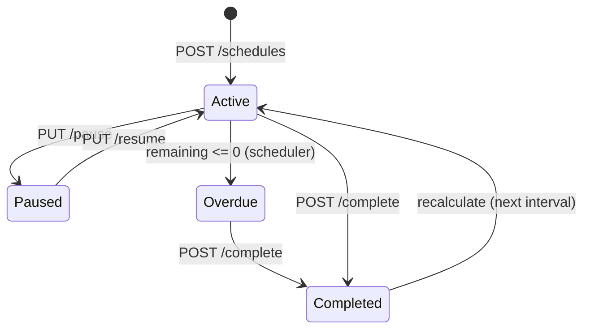

# 🔧 Maintenance Service — REST API

> Тег: `АКТУАЛЬНО` | Обновлён: `2026-06-02` | Версия: `1.0`

## Базовый URL

```
http://localhost:8087/api/v1/maintenance
```

## Аутентификация

Все запросы (кроме `/health`) требуют заголовок:
```
X-Organization-Id: {organizationId}
```

---

## 1. Шаблоны ТО (`/templates`)

### GET /templates

Список шаблонов организации.

**Query параметры:**
| Параметр | Тип | Описание |
|----------|-----|----------|
| `priority` | string | Фильтр по приоритету: `critical`, `high`, `normal`, `low` |
| `intervalType` | string | Фильтр: `mileage`, `engine_hours`, `days`, `combined` |
| `limit` | int | Максимум записей (по умолчанию 50) |
| `offset` | int | Смещение для пагинации |

**Ответ: 200 OK**
```json
{
  "templates": [
    {
      "id": "uuid",
      "organizationId": "uuid",
      "name": "ТО-1 (каждые 15 000 км)",
      "intervalType": "combined",
      "mileageInterval": 15000,
      "engineHoursInterval": null,
      "daysInterval": 365,
      "priority": "normal",
      "estimatedDuration": 120,
      "estimatedCost": 15000.0,
      "items": [
        {
          "id": "uuid",
          "name": "Замена масла",
          "partNumber": "OIL-5W30-4L",
          "estimatedCost": 3500.0,
          "isRequired": true,
          "sortOrder": 1
        }
      ],
      "reminders": [
        { "type": "mileage", "value": 500 },
        { "type": "mileage", "value": 100 },
        { "type": "days", "value": 7 },
        { "type": "days", "value": 1 }
      ],
      "createdAt": "2026-01-15T10:00:00Z",
      "updatedAt": "2026-01-15T10:00:00Z"
    }
  ],
  "total": 12,
  "limit": 50,
  "offset": 0
}
```

### POST /templates

Создать шаблон ТО.

**Тело запроса:**
```json
{
  "name": "ТО-1 (каждые 15 000 км)",
  "intervalType": "combined",
  "mileageInterval": 15000,
  "engineHoursInterval": null,
  "daysInterval": 365,
  "priority": "normal",
  "estimatedDuration": 120,
  "estimatedCost": 15000.0,
  "items": [
    {
      "name": "Замена масла",
      "partNumber": "OIL-5W30-4L",
      "estimatedCost": 3500.0,
      "isRequired": true,
      "sortOrder": 1
    },
    {
      "name": "Замена масляного фильтра",
      "partNumber": "FILT-OIL-001",
      "estimatedCost": 800.0,
      "isRequired": true,
      "sortOrder": 2
    }
  ],
  "reminders": [
    { "type": "mileage", "value": 500 },
    { "type": "mileage", "value": 100 },
    { "type": "days", "value": 7 },
    { "type": "days", "value": 1 }
  ]
}
```

**Ответ: 201 Created**
```json
{
  "id": "uuid",
  "name": "ТО-1 (каждые 15 000 км)",
  "createdAt": "2026-06-02T10:00:00Z"
}
```

### GET /templates/{id}

Получить шаблон по ID (включая items и reminders).

**Ответ: 200 OK** — полный объект шаблона (см. структуру выше).

### PUT /templates/{id}

Обновить шаблон. Тело — аналогично POST. Items и reminders заменяются целиком.

**Ответ: 200 OK**

### DELETE /templates/{id}

Удалить шаблон.

> ⚠️ Невозможно удалить шаблон, если есть активные расписания. Сначала завершите все расписания.

**Ответ: 204 No Content** или **409 Conflict** (если есть активные расписания).

---

## 2. Расписания обслуживания (`/schedules`)

### GET /schedules

Список расписаний организации.

**Query параметры:**
| Параметр | Тип | Описание |
|----------|-----|----------|
| `vehicleId` | uuid | Фильтр по ТС |
| `status` | string | `active`, `paused`, `overdue`, `completed` |
| `templateId` | uuid | Фильтр по шаблону |
| `limit` | int | Максимум записей (по умолчанию 50) |
| `offset` | int | Смещение |

**Ответ: 200 OK**
```json
{
  "schedules": [
    {
      "id": "uuid",
      "vehicleId": "uuid",
      "vehicleName": "Газель A123BC",
      "templateId": "uuid",
      "templateName": "ТО-1 (каждые 15 000 км)",
      "status": "active",
      "lastServiceAt": 45000,
      "lastServiceDate": "2026-03-15T00:00:00Z",
      "nextServiceAt": 60000,
      "nextServiceDate": "2026-09-15T00:00:00Z",
      "currentOdometer": 52340,
      "remainingKm": 7660,
      "remainingDays": 105,
      "priority": "normal",
      "createdAt": "2026-01-15T10:00:00Z"
    }
  ],
  "total": 25,
  "limit": 50,
  "offset": 0
}
```

### POST /schedules

Создать расписание (привязать шаблон к ТС).

**Тело запроса:**
```json
{
  "vehicleId": "uuid",
  "templateId": "uuid",
  "initialOdometer": 45000,
  "initialDate": "2026-03-15T00:00:00Z"
}
```

**Ответ: 201 Created**
```json
{
  "id": "uuid",
  "vehicleId": "uuid",
  "templateId": "uuid",
  "nextServiceAt": 60000,
  "nextServiceDate": "2027-03-15T00:00:00Z",
  "status": "active"
}
```

### GET /schedules/{id}

Получить детали расписания.

### PUT /schedules/{id}/pause

Приостановить расписание (например, на время ремонта ТС).

**Ответ: 200 OK**
```json
{ "id": "uuid", "status": "paused" }
```

### PUT /schedules/{id}/resume

Возобновить расписание.

**Ответ: 200 OK**
```json
{ "id": "uuid", "status": "active" }
```

---

## 3. Записи обслуживания (`/schedules/{id}/services`)

### POST /schedules/{id}/complete

Зарегистрировать выполненное ТО.

**Тело запроса:**
```json
{
  "serviceDate": "2026-06-02T10:00:00Z",
  "odometer": 60120,
  "engineHours": 1250,
  "totalCost": 18500.0,
  "technicianName": "Иванов А.П.",
  "notes": "Заменены все фильтры, масло 5W-30, обнаружен износ тормозных колодок",
  "items": [
    {
      "templateItemId": "uuid",
      "actualCost": 3800.0,
      "partNumber": "OIL-5W30-4L",
      "notes": "Использовано масло Mobil 1"
    },
    {
      "templateItemId": "uuid",
      "actualCost": 900.0,
      "partNumber": "FILT-OIL-001",
      "notes": null
    }
  ]
}
```

**Ответ: 201 Created**
```json
{
  "id": "uuid",
  "scheduleId": "uuid",
  "serviceDate": "2026-06-02T10:00:00Z",
  "totalCost": 18500.0,
  "nextServiceAt": 75120,
  "nextServiceDate": "2027-06-02T00:00:00Z"
}
```

**Побочные эффекты:**
1. Обновлено расписание: `next_service_at += template.mileageInterval`
2. Сброшены Redis-кэши расписания и напоминаний
3. Опубликовано событие `ServiceCompleted` в Kafka

### GET /schedules/{id}/services

История обслуживания для расписания.

**Ответ: 200 OK**
```json
{
  "services": [
    {
      "id": "uuid",
      "serviceDate": "2026-06-02T10:00:00Z",
      "odometer": 60120,
      "totalCost": 18500.0,
      "technicianName": "Иванов А.П.",
      "itemsCount": 5
    }
  ],
  "total": 3
}
```

### GET /schedules/{id}/services/{serviceId}

Детали конкретного обслуживания (включая itemized list).

---

## 4. Пробег и одометр (`/vehicles`)

### GET /vehicles/{id}/mileage

Суточный пробег ТС за период.

**Query параметры:**
| Параметр | Тип | Описание |
|----------|-----|----------|
| `from` | date | Начало периода (обязательный) |
| `to` | date | Конец периода (обязательный) |

**Ответ: 200 OK**
```json
{
  "vehicleId": "uuid",
  "period": { "from": "2026-05-01", "to": "2026-05-31" },
  "totalMileage": 4520.3,
  "avgDailyMileage": 150.7,
  "dailyMileage": [
    { "date": "2026-05-01", "distance": 187.5, "startOdometer": 50000, "endOdometer": 50187 },
    { "date": "2026-05-02", "distance": 142.3, "startOdometer": 50187, "endOdometer": 50330 }
  ]
}
```

### GET /vehicles/{id}/odometer

Текущие показания одометра.

**Ответ: 200 OK**
```json
{
  "vehicleId": "uuid",
  "currentOdometer": 52340.5,
  "lastUpdated": "2026-06-02T09:45:00Z",
  "source": "gps"
}
```

### GET /vehicles/{id}/overview

Обзор ТО по конкретному ТС: все активные расписания, ближайшее ТО, последнее ТО.

**Ответ: 200 OK**
```json
{
  "vehicleId": "uuid",
  "vehicleName": "Газель A123BC",
  "currentOdometer": 52340,
  "activeSchedules": 3,
  "overdueSchedules": 0,
  "nearestService": {
    "scheduleId": "uuid",
    "templateName": "ТО-1",
    "remainingKm": 7660,
    "remainingDays": 105,
    "priority": "normal"
  },
  "lastService": {
    "date": "2026-03-15T00:00:00Z",
    "templateName": "ТО-1",
    "cost": 15000.0
  },
  "predictedNextDate": "2026-08-20T00:00:00Z"
}
```

---

## 5. Служебные эндпоинты

### GET /health

```json
{ "status": "ok", "service": "maintenance-service", "version": "1.0.0" }
```

### GET /metrics

Prometheus-метрики (формат text/plain).

---

## Коды ошибок

| Код | Значение |
|-----|----------|
| 400 | Невалидные данные (например, mileageInterval <= 0) |
| 404 | Шаблон / расписание / запись не найдены |
| 409 | Конфликт (удаление шаблона с активными расписаниями) |
| 422 | Бизнес-ошибка (расписание уже завершено) |
| 500 | Внутренняя ошибка |

## Диаграмма состояний расписания



## Примеры curl

```bash
# Все шаблоны организации
curl -H "X-Organization-Id: org-1" \
  http://localhost:8087/api/v1/maintenance/templates

# Расписания для ТС
curl -H "X-Organization-Id: org-1" \
  "http://localhost:8087/api/v1/maintenance/schedules?vehicleId=vehicle-1"

# Зарегистрировать ТО
curl -X POST -H "Content-Type: application/json" \
  -H "X-Organization-Id: org-1" \
  http://localhost:8087/api/v1/maintenance/schedules/sched-1/complete \
  -d '{"serviceDate":"2026-06-02T10:00:00Z","odometer":60120,"totalCost":18500,"items":[]}'

# Пробег за май
curl -H "X-Organization-Id: org-1" \
  "http://localhost:8087/api/v1/maintenance/vehicles/v-1/mileage?from=2026-05-01&to=2026-05-31"
```
