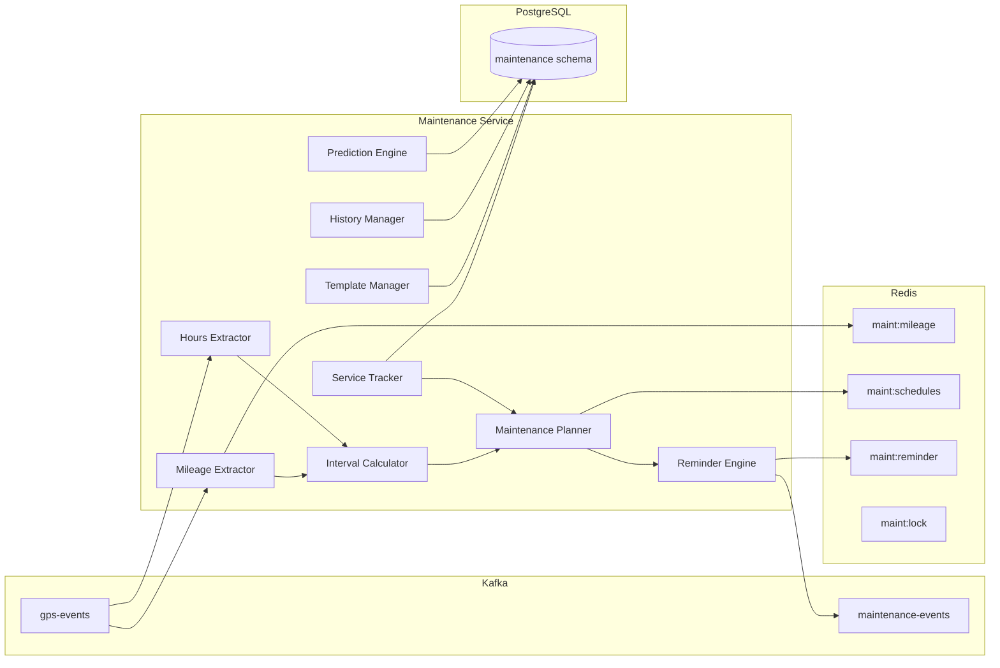
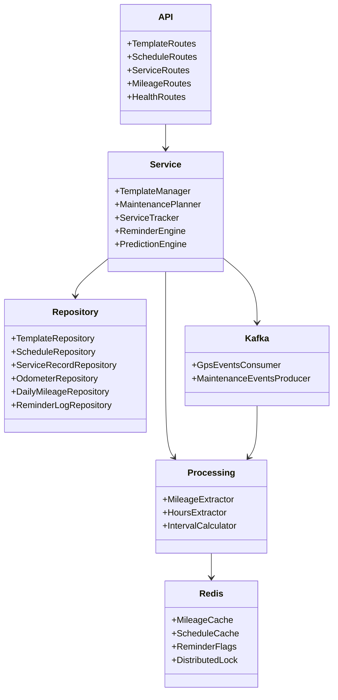
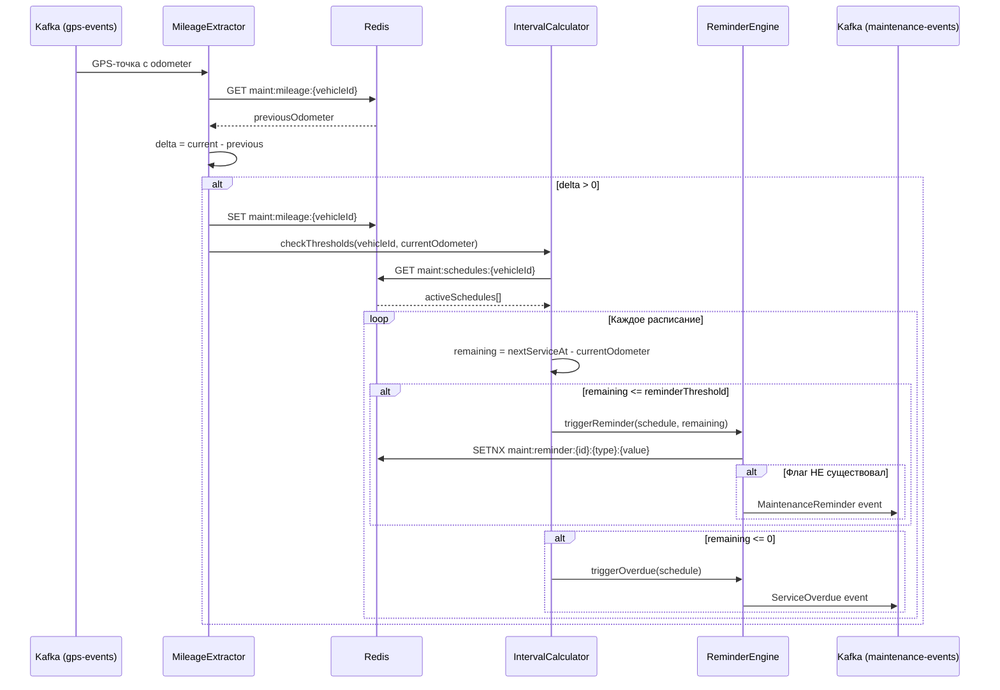
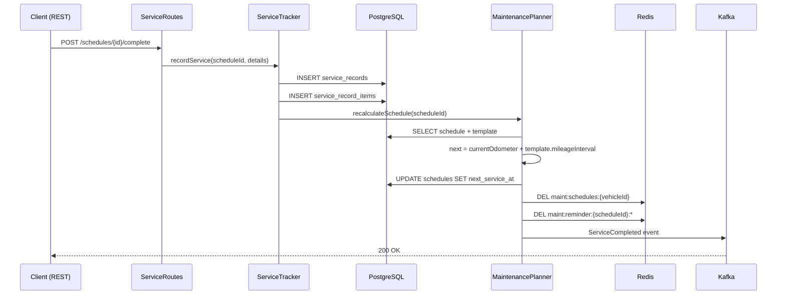
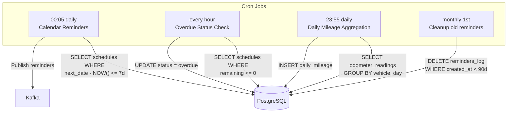

# 🔧 Maintenance Service — Архитектура

> Тег: `АКТУАЛЬНО` | Обновлён: `2026-06-02` | Версия: `1.0`

## Обзор

Maintenance Service состоит из 9 основных компонентов, работающих совместно для отслеживания
пробега, планирования ТО и отправки напоминаний.

## Общая схема



## Архитектура по слоям



## 9 компонентов

### 1. Mileage Extractor
Извлекает значение пробега (`odometer`) из GPS-событий, обновляет Redis-кэш
и запускает проверку порогов ТО.

### 2. Hours Extractor
Извлекает моточасы (`engine_hours`) из GPS-событий. Используется для ТО
по наработке двигателя.

### 3. Interval Calculator
Вычисляет оставшееся расстояние/время до следующего ТО на основе текущего
пробега, моточасов и даты последнего обслуживания. Поддерживает типы:
- `mileage` — каждые N км
- `engine_hours` — каждые N моточасов
- `days` — каждые N дней
- `combined` — первый достигнутый порог (мин из всех)

### 4. Maintenance Planner
Создаёт и обновляет расписания ТО. Привязывает шаблон к ТС, пересчитывает
`next_service_at` после каждого выполненного ТО.

### 5. Service Tracker
Регистрирует выполненное ТО: дата, пробег, стоимость работ и запчастей.
После регистрации — триггерит пересчёт расписания.

### 6. Reminder Engine
Генерирует многоуровневые напоминания:
- За 500 км / 100 км до ТО по пробегу
- За 7 дней / 1 день до ТО по календарю
- При просрочке ТО → событие `ServiceOverdue`

Защита от дублей через Redis-флаги с TTL.

### 7. Template Manager
CRUD операции над шаблонами ТО. Каждый шаблон содержит:
- Тип интервала, значения порогов
- Список работ с артикулами запчастей
- Настройки напоминаний

### 8. History Manager
Хранит полную историю обслуживания ТС. Предоставляет API для
просмотра выполненных работ, затрат и статистики.

### 9. Prediction Engine
Прогнозирует дату следующего ТО на основе среднесуточного пробега.
Использует данные `daily_mileage` за последние 30 дней.

## Поток обработки пробега



## Поток регистрации ТО



## Планировщик (Scheduler)



## Структура пакетов

```
com.wayrecall.tracker.maintenance/
├── Main.scala                          # Точка входа, сборка ZIO Layer
├── config/
│   └── AppConfig.scala                 # Конфигурация: порт, БД, Kafka, Redis, scheduler
├── domain/
│   ├── IntervalType.scala              # enum: Mileage, EngineHours, Days, Combined
│   ├── ServicePriority.scala           # enum: Critical, High, Normal, Low
│   ├── ScheduleStatus.scala            # enum: Active, Paused, Overdue, Completed
│   ├── MaintenanceTemplate.scala       # Шаблон ТО с items и reminders
│   ├── MaintenanceSchedule.scala       # Расписание привязки шаблон→ТС
│   ├── ServiceRecord.scala             # Запись о выполненном ТО
│   ├── OdometerReading.scala           # Показание одометра
│   ├── DailyMileage.scala              # Суточный пробег
│   ├── MaintenanceEvent.scala          # sealed trait: 4 типа событий
│   └── MaintenanceError.scala          # sealed trait: ошибки домена
├── service/
│   ├── TemplateManager.scala           # CRUD шаблонов
│   ├── MaintenancePlanner.scala        # Планирование и пересчёт расписаний
│   ├── ServiceTracker.scala            # Регистрация выполненного ТО
│   ├── ReminderEngine.scala            # Генерация напоминаний
│   ├── PredictionEngine.scala          # Прогноз следующего ТО
│   └── SchedulerService.scala          # 4 cron-задания
├── processing/
│   ├── MileageExtractor.scala          # Извлечение пробега из GPS
│   ├── HoursExtractor.scala            # Извлечение моточасов из GPS
│   └── IntervalCalculator.scala        # Вычисление оставшегося ресурса
├── repository/
│   ├── TemplateRepository.scala        # Doobie: шаблоны + items + reminders
│   ├── ScheduleRepository.scala        # Doobie: расписания
│   ├── ServiceRecordRepository.scala   # Doobie: записи ТО
│   ├── OdometerRepository.scala        # Doobie: показания одометра
│   ├── DailyMileageRepository.scala    # Doobie: суточный пробег
│   └── ReminderLogRepository.scala     # Doobie: лог напоминаний
├── api/
│   ├── TemplateRoutes.scala            # POST/GET/PUT/DELETE /templates
│   ├── ScheduleRoutes.scala            # POST/GET/PUT /schedules
│   ├── ServiceRoutes.scala             # POST /schedules/{id}/complete
│   ├── MileageRoutes.scala             # GET /vehicles/{id}/mileage
│   └── HealthRoutes.scala              # GET /health, /metrics
├── kafka/
│   ├── GpsEventsConsumer.scala         # Consumer: gps-events → MileageExtractor
│   └── MaintenanceEventsProducer.scala # Producer: maintenance-events
└── redis/
    ├── MileageCache.scala              # maint:mileage:{vehicleId}
    ├── ScheduleCache.scala             # maint:schedules:{vehicleId}
    ├── ReminderFlags.scala             # maint:reminder:{scheduleId}:{type}:{value}
    └── DistributedLock.scala           # maint:lock:mileage:{vehicleId}
```

## ZIO Layer

```scala
// Порядок сборки слоёв в Main.scala
val appLayer = ZLayer.make[AppDependencies](
  // Конфигурация
  AppConfig.live,
  // Инфраструктура
  DataSource.live,
  RedisClient.live,
  KafkaConsumer.live,
  KafkaProducer.live,
  // Репозитории
  TemplateRepository.live,
  ScheduleRepository.live,
  ServiceRecordRepository.live,
  OdometerRepository.live,
  DailyMileageRepository.live,
  ReminderLogRepository.live,
  // Redis
  MileageCache.live,
  ScheduleCache.live,
  ReminderFlags.live,
  DistributedLock.live,
  // Processing
  MileageExtractor.live,
  HoursExtractor.live,
  IntervalCalculator.live,
  // Сервисы
  TemplateManager.live,
  MaintenancePlanner.live,
  ServiceTracker.live,
  ReminderEngine.live,
  PredictionEngine.live,
  SchedulerService.live,
  // Kafka
  GpsEventsConsumer.live,
  MaintenanceEventsProducer.live,
  // API
  TemplateRoutes.live,
  ScheduleRoutes.live,
  ServiceRoutes.live,
  MileageRoutes.live,
  HealthRoutes.live,
)
```
