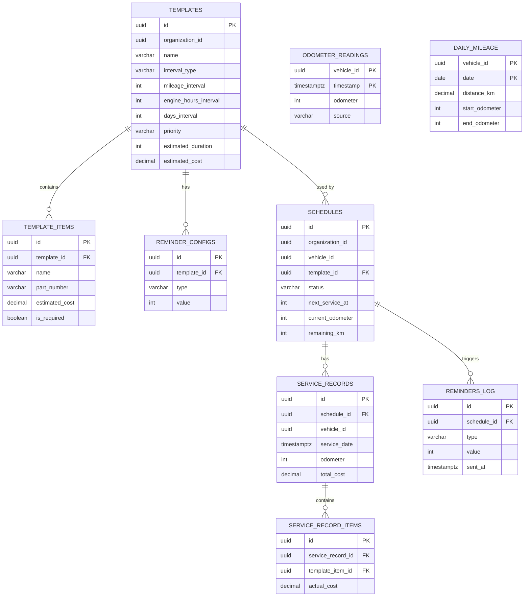

# 🔧 Maintenance Service — Модель данных

> Тег: `АКТУАЛЬНО` | Обновлён: `2026-06-02` | Версия: `1.0`

## PostgreSQL — Схема `maintenance`

### Таблицы

#### 1. `maintenance.templates`

Шаблоны ТО (типы обслуживания).

```sql
CREATE SCHEMA IF NOT EXISTS maintenance;

CREATE TABLE maintenance.templates (
    id              UUID PRIMARY KEY DEFAULT gen_random_uuid(),
    organization_id UUID NOT NULL,
    name            VARCHAR(255) NOT NULL,
    interval_type   VARCHAR(20) NOT NULL CHECK (interval_type IN ('mileage', 'engine_hours', 'days', 'combined')),
    mileage_interval    INTEGER,          -- км между ТО
    engine_hours_interval INTEGER,        -- моточасы между ТО
    days_interval       INTEGER,          -- дни между ТО
    priority        VARCHAR(10) NOT NULL DEFAULT 'normal' CHECK (priority IN ('critical', 'high', 'normal', 'low')),
    estimated_duration  INTEGER,          -- минуты на ТО
    estimated_cost      DECIMAL(10, 2),   -- ожидаемая стоимость
    is_active       BOOLEAN NOT NULL DEFAULT true,
    created_at      TIMESTAMPTZ NOT NULL DEFAULT now(),
    updated_at      TIMESTAMPTZ NOT NULL DEFAULT now()
);

CREATE INDEX idx_templates_org ON maintenance.templates(organization_id);
CREATE INDEX idx_templates_priority ON maintenance.templates(organization_id, priority);
```

#### 2. `maintenance.template_items`

Список работ/запчастей в шаблоне.

```sql
CREATE TABLE maintenance.template_items (
    id          UUID PRIMARY KEY DEFAULT gen_random_uuid(),
    template_id UUID NOT NULL REFERENCES maintenance.templates(id) ON DELETE CASCADE,
    name        VARCHAR(255) NOT NULL,
    part_number VARCHAR(100),
    estimated_cost DECIMAL(10, 2),
    is_required BOOLEAN NOT NULL DEFAULT true,
    sort_order  INTEGER NOT NULL DEFAULT 0,
    created_at  TIMESTAMPTZ NOT NULL DEFAULT now()
);

CREATE INDEX idx_template_items_template ON maintenance.template_items(template_id);
```

#### 3. `maintenance.reminder_configs`

Настройки напоминаний для шаблона.

```sql
CREATE TABLE maintenance.reminder_configs (
    id          UUID PRIMARY KEY DEFAULT gen_random_uuid(),
    template_id UUID NOT NULL REFERENCES maintenance.templates(id) ON DELETE CASCADE,
    type        VARCHAR(20) NOT NULL CHECK (type IN ('mileage', 'days')),
    value       INTEGER NOT NULL,  -- km или дни ДО ТО
    created_at  TIMESTAMPTZ NOT NULL DEFAULT now()
);

CREATE INDEX idx_reminder_configs_template ON maintenance.reminder_configs(template_id);
```

#### 4. `maintenance.schedules`

Расписания — привязка шаблона к конкретному ТС.

```sql
CREATE TABLE maintenance.schedules (
    id              UUID PRIMARY KEY DEFAULT gen_random_uuid(),
    organization_id UUID NOT NULL,
    vehicle_id      UUID NOT NULL,
    template_id     UUID NOT NULL REFERENCES maintenance.templates(id),
    status          VARCHAR(20) NOT NULL DEFAULT 'active'
                    CHECK (status IN ('active', 'paused', 'overdue', 'completed')),
    last_service_at     INTEGER,                    -- пробег на момент последнего ТО
    last_service_date   TIMESTAMPTZ,                -- дата последнего ТО
    next_service_at     INTEGER NOT NULL,            -- пробег следующего ТО
    next_service_date   TIMESTAMPTZ,                -- дата следующего ТО
    current_odometer    INTEGER NOT NULL DEFAULT 0,  -- текущий пробег (обновляется из GPS)
    remaining_km        INTEGER GENERATED ALWAYS AS (next_service_at - current_odometer) STORED,
    created_at      TIMESTAMPTZ NOT NULL DEFAULT now(),
    updated_at      TIMESTAMPTZ NOT NULL DEFAULT now()
);

CREATE INDEX idx_schedules_org ON maintenance.schedules(organization_id);
CREATE INDEX idx_schedules_vehicle ON maintenance.schedules(vehicle_id, status);
CREATE INDEX idx_schedules_status ON maintenance.schedules(organization_id, status);
CREATE INDEX idx_schedules_next ON maintenance.schedules(next_service_at) WHERE status = 'active';
```

#### 5. `maintenance.service_records`

Записи о выполненных ТО.

```sql
CREATE TABLE maintenance.service_records (
    id              UUID PRIMARY KEY DEFAULT gen_random_uuid(),
    schedule_id     UUID NOT NULL REFERENCES maintenance.schedules(id),
    organization_id UUID NOT NULL,
    vehicle_id      UUID NOT NULL,
    service_date    TIMESTAMPTZ NOT NULL,
    odometer        INTEGER NOT NULL,
    engine_hours    INTEGER,
    total_cost      DECIMAL(10, 2),
    technician_name VARCHAR(255),
    notes           TEXT,
    created_at      TIMESTAMPTZ NOT NULL DEFAULT now()
);

CREATE INDEX idx_service_records_schedule ON maintenance.service_records(schedule_id);
CREATE INDEX idx_service_records_vehicle ON maintenance.service_records(vehicle_id, service_date DESC);
CREATE INDEX idx_service_records_org ON maintenance.service_records(organization_id);
```

#### 6. `maintenance.service_record_items`

Детализация работ в ТО.

```sql
CREATE TABLE maintenance.service_record_items (
    id                UUID PRIMARY KEY DEFAULT gen_random_uuid(),
    service_record_id UUID NOT NULL REFERENCES maintenance.service_records(id) ON DELETE CASCADE,
    template_item_id  UUID REFERENCES maintenance.template_items(id),
    name              VARCHAR(255) NOT NULL,
    part_number       VARCHAR(100),
    actual_cost       DECIMAL(10, 2),
    notes             TEXT,
    created_at        TIMESTAMPTZ NOT NULL DEFAULT now()
);

CREATE INDEX idx_record_items_record ON maintenance.service_record_items(service_record_id);
```

#### 7. `maintenance.odometer_readings`

Показания одометра (из GPS).

```sql
CREATE TABLE maintenance.odometer_readings (
    vehicle_id  UUID NOT NULL,
    timestamp   TIMESTAMPTZ NOT NULL,
    odometer    INTEGER NOT NULL,
    source      VARCHAR(20) NOT NULL DEFAULT 'gps', -- gps, manual
    PRIMARY KEY (vehicle_id, timestamp)
);

-- Партиционирование по месяцам
CREATE INDEX idx_odometer_vehicle_time ON maintenance.odometer_readings(vehicle_id, timestamp DESC);
```

#### 8. `maintenance.daily_mileage`

Суточный пробег (агрегация из одометра).

```sql
CREATE TABLE maintenance.daily_mileage (
    vehicle_id      UUID NOT NULL,
    date            DATE NOT NULL,
    distance_km     DECIMAL(10, 2) NOT NULL,
    start_odometer  INTEGER NOT NULL,
    end_odometer    INTEGER NOT NULL,
    organization_id UUID NOT NULL,
    created_at      TIMESTAMPTZ NOT NULL DEFAULT now(),
    PRIMARY KEY (vehicle_id, date)
);

CREATE INDEX idx_daily_mileage_org ON maintenance.daily_mileage(organization_id, date);
```

#### 9. `maintenance.reminders_log`

Лог отправленных напоминаний (для аудита, защита от дублей).

```sql
CREATE TABLE maintenance.reminders_log (
    id          UUID PRIMARY KEY DEFAULT gen_random_uuid(),
    schedule_id UUID NOT NULL REFERENCES maintenance.schedules(id),
    type        VARCHAR(20) NOT NULL,  -- mileage, days, overdue
    value       INTEGER NOT NULL,       -- порог (500км / 7дней / 0)
    sent_at     TIMESTAMPTZ NOT NULL DEFAULT now(),
    channel     VARCHAR(20),            -- push, email, sms
    status      VARCHAR(20) NOT NULL DEFAULT 'sent'
);

CREATE INDEX idx_reminders_log_schedule ON maintenance.reminders_log(schedule_id, type, value);
CREATE INDEX idx_reminders_log_cleanup ON maintenance.reminders_log(sent_at);
```

### Представления (Views)

```sql
-- Обзор ТО по ТС
CREATE VIEW maintenance.vehicle_overview AS
SELECT
    s.organization_id,
    s.vehicle_id,
    COUNT(*) FILTER (WHERE s.status = 'active') AS active_schedules,
    COUNT(*) FILTER (WHERE s.status = 'overdue') AS overdue_schedules,
    MIN(s.remaining_km) FILTER (WHERE s.status = 'active') AS nearest_remaining_km,
    (SELECT sr.service_date FROM maintenance.service_records sr
     WHERE sr.vehicle_id = s.vehicle_id ORDER BY sr.service_date DESC LIMIT 1) AS last_service_date,
    (SELECT SUM(sr.total_cost) FROM maintenance.service_records sr
     WHERE sr.vehicle_id = s.vehicle_id) AS total_spent
FROM maintenance.schedules s
GROUP BY s.organization_id, s.vehicle_id;

-- Статистика шаблонов
CREATE VIEW maintenance.template_stats AS
SELECT
    t.id AS template_id,
    t.organization_id,
    t.name,
    COUNT(DISTINCT s.id) AS schedules_count,
    COUNT(DISTINCT sr.id) AS services_count,
    AVG(sr.total_cost) AS avg_service_cost
FROM maintenance.templates t
LEFT JOIN maintenance.schedules s ON s.template_id = t.id
LEFT JOIN maintenance.service_records sr ON sr.schedule_id = s.id
GROUP BY t.id, t.organization_id, t.name;
```

### Триггер-функция

```sql
-- Автоматическое обновление remaining при изменении одометра
CREATE OR REPLACE FUNCTION maintenance.update_schedule_remaining()
RETURNS TRIGGER AS $$
BEGIN
    UPDATE maintenance.schedules
    SET current_odometer = NEW.odometer,
        updated_at = now()
    WHERE vehicle_id = NEW.vehicle_id
      AND status IN ('active', 'overdue');
    RETURN NEW;
END;
$$ LANGUAGE plpgsql;

CREATE TRIGGER trg_odometer_update
    AFTER INSERT ON maintenance.odometer_readings
    FOR EACH ROW
    EXECUTE FUNCTION maintenance.update_schedule_remaining();
```

### Функция расчёта следующего ТО

```sql
CREATE OR REPLACE FUNCTION maintenance.calculate_next_service(
    p_schedule_id UUID,
    p_current_odometer INTEGER,
    p_current_date TIMESTAMPTZ
) RETURNS TABLE(next_odometer INTEGER, next_date TIMESTAMPTZ) AS $$
DECLARE
    v_template maintenance.templates%ROWTYPE;
    v_schedule maintenance.schedules%ROWTYPE;
BEGIN
    SELECT s.* INTO v_schedule FROM maintenance.schedules s WHERE s.id = p_schedule_id;
    SELECT t.* INTO v_template FROM maintenance.templates t WHERE t.id = v_schedule.template_id;

    next_odometer := CASE
        WHEN v_template.mileage_interval IS NOT NULL THEN p_current_odometer + v_template.mileage_interval
        ELSE NULL
    END;

    next_date := CASE
        WHEN v_template.days_interval IS NOT NULL THEN p_current_date + (v_template.days_interval || ' days')::INTERVAL
        ELSE NULL
    END;

    RETURN NEXT;
END;
$$ LANGUAGE plpgsql;
```

### Flyway миграции

| Версия | Файл | Описание |
|--------|------|----------|
| V1 | `V1__create_schema.sql` | Создание схемы `maintenance` |
| V2 | `V2__create_templates.sql` | Таблицы templates, template_items, reminder_configs |
| V3 | `V3__create_schedules.sql` | Таблица schedules с generated column |
| V4 | `V4__create_service_records.sql` | Таблицы service_records, service_record_items |
| V5 | `V5__create_odometer.sql` | Таблицы odometer_readings, daily_mileage |
| V6 | `V6__create_reminders_log.sql` | Таблица reminders_log |
| V7 | `V7__create_views.sql` | Views: vehicle_overview, template_stats |
| V8 | `V8__create_functions.sql` | Trigger + function |

---

## Redis

### Ключи

| Ключ | Тип | TTL | Описание |
|------|-----|-----|----------|
| `maint:mileage:{vehicleId}` | STRING | — | Текущий пробег (км, целое число) |
| `maint:schedules:{vehicleId}` | STRING (JSON) | 3600s | Кэш активных расписаний ТС |
| `maint:reminder:{scheduleId}:{type}:{value}` | STRING | 86400s | Флаг: напоминание отправлено |
| `maint:lock:mileage:{vehicleId}` | STRING | 5s | Distributed lock для обновления пробега |

### Операции

**Обновление пробега (MileageExtractor):**
```
SET maint:mileage:{vehicleId} 52340
```

**Кэш расписаний (ScheduleCache):**
```
GET maint:schedules:{vehicleId}
→ null → загрузить из PostgreSQL → SET с TTL 3600

SET maint:schedules:{vehicleId} '[{"id":"...","nextServiceAt":60000,...}]' EX 3600
```

**Флаг напоминания (ReminderFlags):**
```
-- Попытка установить флаг (idempotent)
SETNX maint:reminder:sched-1:mileage:500 "sent"
EXPIRE maint:reminder:sched-1:mileage:500 86400

-- Результат: 1 = новый (отправить), 0 = уже отправлено (пропустить)
```

**Distributed Lock (DistributedLock):**
```
-- Блокировка для конкурентных обновлений одного ТС
SET maint:lock:mileage:{vehicleId} {instanceId} NX EX 5
-- ... обработка ...
DEL maint:lock:mileage:{vehicleId}
```

---

## Scala Domain Models

### Enumerations

```scala
// Тип интервала ТО
enum IntervalType:
  case Mileage, EngineHours, Days, Combined

// Приоритет ТО
enum ServicePriority:
  case Critical, High, Normal, Low

// Статус расписания
enum ScheduleStatus:
  case Active, Paused, Overdue, Completed
```

### Шаблоны

```scala
// Шаблон ТО
final case class MaintenanceTemplate(
  id: UUID,
  organizationId: UUID,
  name: String,
  intervalType: IntervalType,
  mileageInterval: Option[Int],
  engineHoursInterval: Option[Int],
  daysInterval: Option[Int],
  priority: ServicePriority,
  estimatedDuration: Option[Int],     // минуты
  estimatedCost: Option[BigDecimal],
  items: List[MaintenanceItem],
  reminders: List[ReminderConfig],
  isActive: Boolean,
  createdAt: Instant,
  updatedAt: Instant
)

// Позиция в шаблоне
final case class MaintenanceItem(
  id: UUID,
  name: String,
  partNumber: Option[String],
  estimatedCost: Option[BigDecimal],
  isRequired: Boolean,
  sortOrder: Int
)

// Настройка напоминания
final case class ReminderConfig(
  id: UUID,
  reminderType: String,     // "mileage" | "days"
  value: Int                // км или дни до ТО
)
```

### Расписания и записи

```scala
// Расписание ТО (привязка шаблон→ТС)
final case class MaintenanceSchedule(
  id: UUID,
  organizationId: UUID,
  vehicleId: UUID,
  templateId: UUID,
  status: ScheduleStatus,
  lastServiceAt: Option[Int],
  lastServiceDate: Option[Instant],
  nextServiceAt: Int,
  nextServiceDate: Option[Instant],
  currentOdometer: Int,
  remainingKm: Int,
  createdAt: Instant,
  updatedAt: Instant
)

// Запись выполненного ТО
final case class ServiceRecord(
  id: UUID,
  scheduleId: UUID,
  organizationId: UUID,
  vehicleId: UUID,
  serviceDate: Instant,
  odometer: Int,
  engineHours: Option[Int],
  totalCost: Option[BigDecimal],
  technicianName: Option[String],
  notes: Option[String],
  items: List[ServiceItemRecord],
  createdAt: Instant
)

// Позиция в записи ТО
final case class ServiceItemRecord(
  id: UUID,
  templateItemId: Option[UUID],
  name: String,
  partNumber: Option[String],
  actualCost: Option[BigDecimal],
  notes: Option[String]
)
```

### Одометр и пробег

```scala
// Показание одометра
final case class OdometerReading(
  vehicleId: UUID,
  timestamp: Instant,
  odometer: Int,
  source: String      // "gps" | "manual"
)

// Суточный пробег
final case class DailyMileage(
  vehicleId: UUID,
  date: LocalDate,
  distanceKm: BigDecimal,
  startOdometer: Int,
  endOdometer: Int,
  organizationId: UUID
)
```

### События и ошибки

```scala
// Kafka-события ТО
sealed trait MaintenanceEvent:
  def scheduleId: UUID
  def vehicleId: UUID
  def organizationId: UUID
  def timestamp: Instant

object MaintenanceEvent:
  final case class ScheduleCreated(
    scheduleId: UUID, vehicleId: UUID, organizationId: UUID,
    templateName: String, nextServiceAt: Int, timestamp: Instant
  ) extends MaintenanceEvent

  final case class ServiceDueReminder(
    scheduleId: UUID, vehicleId: UUID, organizationId: UUID,
    templateName: String, reminderType: String, remainingValue: Int,
    priority: ServicePriority, timestamp: Instant
  ) extends MaintenanceEvent

  final case class ServiceOverdue(
    scheduleId: UUID, vehicleId: UUID, organizationId: UUID,
    templateName: String, overdueKm: Int, overdueDays: Int,
    priority: ServicePriority, timestamp: Instant
  ) extends MaintenanceEvent

  final case class ServiceCompleted(
    scheduleId: UUID, vehicleId: UUID, organizationId: UUID,
    serviceRecordId: UUID, odometer: Int, totalCost: Option[BigDecimal],
    nextServiceAt: Int, timestamp: Instant
  ) extends MaintenanceEvent

// Ошибки домена
sealed trait MaintenanceError
object MaintenanceError:
  case class TemplateNotFound(id: UUID) extends MaintenanceError
  case class ScheduleNotFound(id: UUID) extends MaintenanceError
  case class TemplateHasActiveSchedules(id: UUID, count: Int) extends MaintenanceError
  case class ScheduleAlreadyCompleted(id: UUID) extends MaintenanceError
  case class InvalidInterval(message: String) extends MaintenanceError
  case class VehicleNotFound(id: UUID) extends MaintenanceError
  case class DatabaseError(cause: Throwable) extends MaintenanceError
  case class RedisError(cause: Throwable) extends MaintenanceError
```

---

## ER Диаграмма


