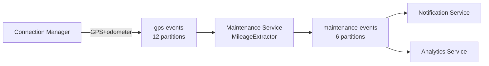

# 🔧 Maintenance Service — Kafka

> Тег: `АКТУАЛЬНО` | Обновлён: `2026-06-02` | Версия: `1.0`

## Обзор



## Потребляемые топики

### `gps-events`

| Параметр | Значение |
|----------|----------|
| **Consumer group** | `maintenance-service-mileage` |
| **Partitions** | 12 |
| **Auto offset reset** | `latest` |
| **Max poll records** | 500 |
| **Session timeout** | 30s |

**Что извлекается:**
- `odometer` — показания одометра (км)
- `engineHours` — моточасы (если доступны)
- `vehicleId` — ID транспортного средства
- `timestamp` — время GPS-точки

**Формат входящего сообщения (используемые поля):**
```json
{
  "vehicleId": "uuid",
  "deviceId": 12345,
  "timestamp": "2026-06-02T09:45:00Z",
  "latitude": 55.7558,
  "longitude": 37.6173,
  "speed": 60,
  "odometer": 52340,
  "engineHours": 1250,
  "ioData": { ... }
}
```

**Логика обработки:**
1. Извлечь `odometer` и `engineHours` (если есть)
2. Сравнить с предыдущим значением в Redis (`maint:mileage:{vehicleId}`)
3. Если delta > 0 → обновить Redis, проверить пороги ТО
4. Если порог достигнут → сгенерировать напоминание в `maintenance-events`
5. Если `odometer` отсутствует — пропустить

**Фильтрация:**
- Сообщения без поля `odometer` игнорируются
- Дельта ≤ 0 (откатился одометр) → логировать warning, не обрабатывать
- Дельта > 1000 км за 1 минуту → аномалия, логировать error

---

## Публикуемые топики

### `maintenance-events`

| Параметр | Значение |
|----------|----------|
| **Partitions** | 6 |
| **Ключ партиции** | `vehicleId` |
| **Retention** | 30 дней |
| **Compression** | lz4 |

**Типы событий (поле `eventType`):**

#### 1. `ScheduleCreated`
Создано новое расписание ТО.

```json
{
  "eventType": "ScheduleCreated",
  "scheduleId": "uuid",
  "vehicleId": "uuid",
  "organizationId": "uuid",
  "templateName": "ТО-1 (каждые 15 000 км)",
  "nextServiceAt": 60000,
  "timestamp": "2026-06-02T10:00:00Z"
}
```

#### 2. `ServiceDueReminder`
Напоминание о приближающемся ТО.

```json
{
  "eventType": "ServiceDueReminder",
  "scheduleId": "uuid",
  "vehicleId": "uuid",
  "organizationId": "uuid",
  "templateName": "ТО-1",
  "reminderType": "mileage",
  "remainingValue": 500,
  "priority": "normal",
  "timestamp": "2026-06-02T09:45:00Z"
}
```

#### 3. `ServiceOverdue`
ТО просрочено.

```json
{
  "eventType": "ServiceOverdue",
  "scheduleId": "uuid",
  "vehicleId": "uuid",
  "organizationId": "uuid",
  "templateName": "ТО-1",
  "overdueKm": 1200,
  "overdueDays": 15,
  "priority": "critical",
  "timestamp": "2026-06-02T10:00:00Z"
}
```

#### 4. `ServiceCompleted`
ТО выполнено.

```json
{
  "eventType": "ServiceCompleted",
  "scheduleId": "uuid",
  "vehicleId": "uuid",
  "organizationId": "uuid",
  "serviceRecordId": "uuid",
  "odometer": 60120,
  "totalCost": 18500.0,
  "nextServiceAt": 75120,
  "timestamp": "2026-06-02T12:00:00Z"
}
```

---

## Гарантия порядка

- Ключ партиции: `vehicleId` → все события одного ТС в одной партиции
- Это гарантирует:
  - Напоминания приходят в правильном порядке (500км, 100км, overdue)
  - `ServiceCompleted` после `ServiceDueReminder`
  - Нет гонки между update и complete

## Идемпотентность

- Consumer использует `enable.auto.commit = false`
- Offset коммитится после успешной обработки batch'а
- Redis-флаги `maint:reminder:*` защищают от повторной отправки напоминаний
- Distributed Lock `maint:lock:mileage:*` защищает от конкурентных обновлений

## Связанные документы

- [infra/kafka/TOPICS.md](../../../infra/kafka/TOPICS.md) — Все Kafka топики системы
- [DATA_MODEL.md](DATA_MODEL.md) — Redis ключи и PostgreSQL схема
