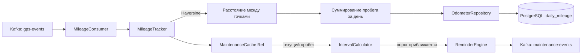

> Тег: `АКТУАЛЬНО` | Обновлён: `2026-03-02` | Версия: `1.0`

# 📖 Изучение Maintenance Service

> Руководство по Maintenance Service — сервису планового техобслуживания.

---

## 1. Назначение

**Maintenance Service (MS)** — управление плановым ТО транспортных средств:
- Шаблоны ТО (замена масла каждые 10000 км или 6 мес.)
- Расписания ТО для каждого ТС
- Подсчёт пробега из GPS-данных (Kafka consumer `gps-events`)
- Напоминания при приближении к порогу ТО
- История обслуживания

**Порт:** 8087. Kafka: consume `gps-events` (для пробега), produce `maintenance-events`

---

## 2. Архитектура

```
Kafka (gps-events) → MileageConsumer → MileageTracker → OdometerRepository (PostgreSQL)
                                                              ↓
MaintenanceRoutes → MaintenanceService → MaintenancePlanner → ScheduleRepository
                                      → IntervalCalculator → проверка порогов
                                      → ReminderEngine → MaintenanceEventProducer → Kafka
                                      
MaintenanceJobs (фоновый scheduler) → ежедневная проверка всех расписаний
```

### Компоненты

| Файл | Назначение |
|------|-----------|
| `kafka/MileageConsumer.scala` | GPS → подсчёт пробега |
| `service/MileageTracker.scala` | Haversine: расстояние между точками |
| `service/IntervalCalculator.scala` | Когда следующее ТО (по км или дате) |
| `service/MaintenancePlanner.scala` | Создание/обновление расписаний |
| `service/ReminderEngine.scala` | Генерация напоминаний |
| `scheduler/MaintenanceJobs.scala` | Фоновые задачи (ежедневная проверка) |
| `cache/MaintenanceCache.scala` | Кэш пробегов (Ref) |
| `repository/TemplateRepository.scala` | Шаблоны ТО |
| `repository/ScheduleRepository.scala` | Расписания ТО |
| `repository/ServiceRecordRepository.scala` | История обслуживания |
| `repository/OdometerRepository.scala` | Показания одометра / моточасов |

---

## 3. Domain модель

```scala
// Шаблон ТО (один для всего автопарка / типа ТС)
case class MaintenanceTemplate(
  id: Long,
  organizationId: OrganizationId,
  name: String,                     // "Замена масла"
  items: List[MaintenanceItem],     // [{name="масло", type=OilChange, interval=10000km}]
  reminder: ReminderConfig          // За 500 км / 7 дней напомнить
)

enum IntervalType:
  case Mileage(km: Double)          // Каждые N км
  case Time(months: Int)            // Каждые N месяцев
  case EngineHours(hours: Double)   // Каждые N моточасов
  case MileageOrTime(km: Double, months: Int) // Что наступит раньше

// Расписание ТО для конкретного ТС
case class MaintenanceSchedule(
  id: Long,
  vehicleId: VehicleId,
  templateId: Long,
  status: ScheduleStatus,          // Pending / Overdue / Completed
  nextServiceAt: Either[Double, Instant], // Пробег или дата
  lastServiceAt: Option[Instant],
  lastServiceMileage: Option[Double]
)

// Запись об обслуживании
case class ServiceRecord(
  id: Long,
  vehicleId: VehicleId,
  scheduleId: Long,
  serviceDate: Instant,
  mileageAtService: Double,
  engineHoursAtService: Option[Double],
  description: String,
  cost: Option[BigDecimal],
  performedBy: Option[String]
)
```

---

## 4. Подсчёт пробега из GPS



**Формула Haversine** — расстояние между двумя GPS-точками на сфере:
```
a = sin²(Δlat/2) + cos(lat1) · cos(lat2) · sin²(Δlon/2)
c = 2 · atan2(√a, √(1−a))
d = R · c  (R = 6371 км)
```

---

## 5. API endpoints

```bash
# Шаблоны ТО
POST   /templates          # Создать шаблон ТО
GET    /templates          
PUT    /templates/{id}     
DELETE /templates/{id}     

# Расписания
POST   /schedules          # Назначить ТО для ТС
GET    /schedules?vehicleId=42
PUT    /schedules/{id}     
POST   /schedules/{id}/complete  # Отметить ТО выполненным

# История обслуживания
POST   /service-records    
GET    /service-records?vehicleId=42

# Обзор состояния
GET    /overview/{vehicleId}       # Статус всех ТО для ТС
GET    /overview/company           # Сводка по организации

# Пробег
GET    /mileage/{vehicleId}?from=...&to=...  # Пробег за период

# Health
GET    /health
```

---

## 6. Типичные ошибки

| Проблема | Причина | Решение |
|----------|---------|---------|
| Пробег не считается | MileageConsumer не получает gps-events | Проверить consumer group, Kafka lag |
| Пробег завышен | GPS шум (прыжки) | Проверить фильтры в CM (DeadReckoning) |
| Напоминание не пришло | ReminderEngine не запущен | Проверить MaintenanceJobs (forkDaemon) |
| inline limit exceeded | Большой case class с derives | `-Xmax-inlines:64` в build.sbt |

---

*Версия: 1.0 | Обновлён: 2 марта 2026*
